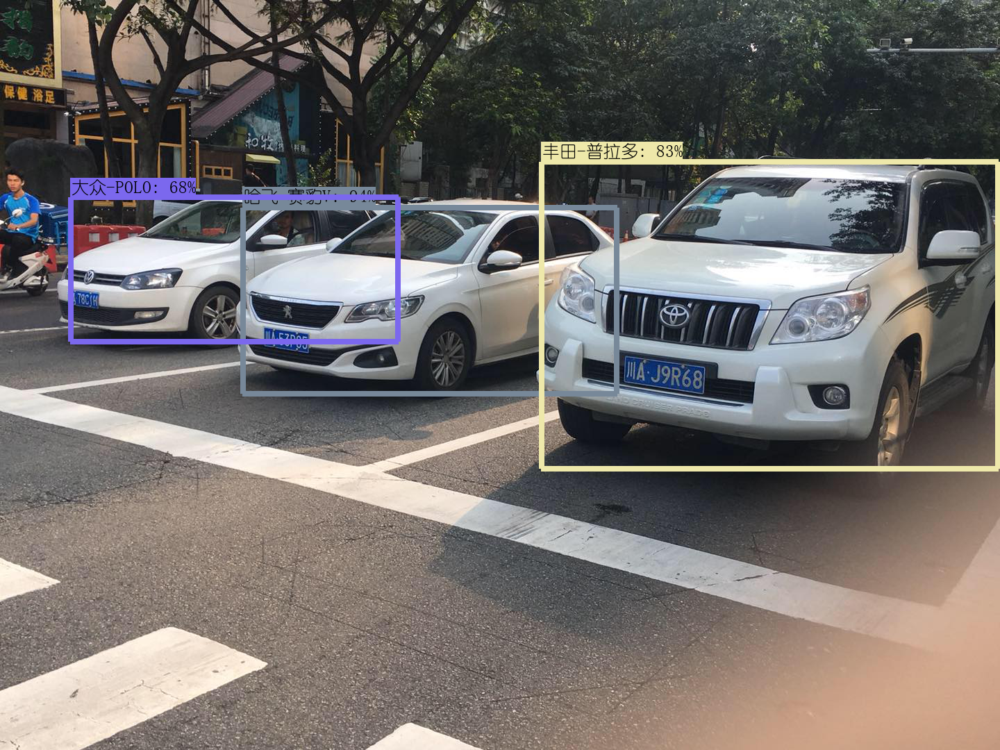
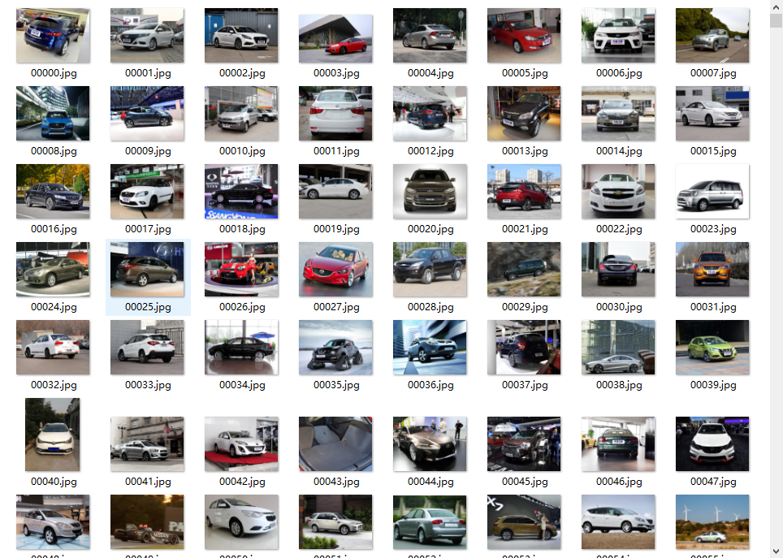
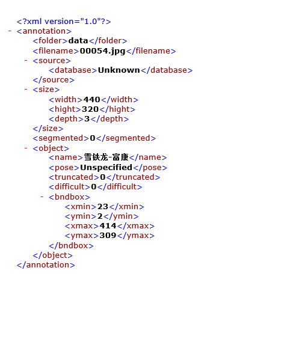
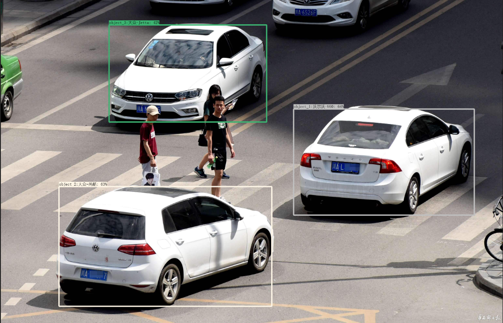

# grand_vehicle_detection
a ssd_moblienet vehicel detection systems base on Tensorflow

This is instruction for training a vihicel detector using the Tensorflow Object Detection systems. I will list the steps in details as possible as I can, if any questions or errors please let me know. The output of the detector will look like the following:



## get vehicle datasets
The datasets all are from '汽车之家' [website](https://www.autohome.com.cn), we use Web crawler to download the vehicle images including  their labels, and totally there are 48856 pictures and 764 classfications. but the label only with classfication is not enough for object detection, we need location information for each image.

the downloaded images are following:


## get loaction information and write into xml
In order to train a detector, we require a dataset of images, bounding boxes and classifications. my method is utilizing the ssd_mobilenet models pretrained on coco datasets which can find out car and truck appearing in the picture, and exchange location information to coordinates, finally write into xml. Run the following commands:

``` bash
python get_image_label.py \
```

There may be some codes need to modify, you could modify it according to your needs. In my example, we put tfrecord files in path `./slim/data`, which those tfrecord files don't include location information. 

The generated xml file is like following: 


## write images and xmls into tfrecord
After preparing your images and xmls, your `./data` directory should appear as follows:

```lang-none
- labels.txt
+ images/
  + train/
  + eval/
+ annotations/
  - eval.txt
  - train.txt
  + xmls/
    + train/
    + eval/
```

and run the `create_tf_record.py`,  tfrecord files for training will be generated in path `./output`

## Configuring the Object Detection Pipeline
The model parameters, training parameters and eval parameters are all defined by a config file. more details you could consult the [Tensorflow Object Detection API](https://github.com/tensorflow/models/edit/master/research/object_detection). In our example, we 'usessd_mobilenet_v1' model and corresponding parameters has been set up in config flies, you could modify it according to your needs.

## Starting Training Jobs
Note: `run.sh` is a shell script, which help us starting training, evaluation and exporting at one step. 

To start training, execute the following command from the directory:

``` bash
python ./object_detection/train.py --train_dir='./output/train' --pipeline_config_path='./super_ssd_mobilenet_v1_vehicle.config'
```

Usually, it takes long time for training, when the training ends up, `model.ckpt` file will be generated in path `./output/train`, and this file contain weights information of ssd_mobilenet model, which apply to next step

## Exporting the Tensorflow Graph
After your model has been trained, you should export it to a Tensorflow graph proto. The checkpoint will typically consist of three files:

* `model.ckpt-${CHECKPOINT_NUMBER}.data-00000-of-00001`
* `model.ckpt-${CHECKPOINT_NUMBER}.index`
* `model.ckpt-${CHECKPOINT_NUMBER}.meta`

After confirmation, run the following command:

``` bash
python ./object_detection/export_inference_graph.py 
--input_type image_tensor 
--pipeline_config_path './super_ssd_mobilenet_v1_vehicle.config'
--trained_checkpoint_prefix './output/train/model.ckpt-$current'
--output_directory './output/exported_graphs'
```

Afterwards, you should see a directory named exported_graphs containing the SavedModel and frozen graph like this: `frozen_inference_graph.pb`, and this pb file is neccessary for inference.

## Inference image
we have pb file now, and put `frozen_inference_graph.pb` in path `./input_dir`, then choose an image into `./input_dir`, don't forget modity the image name, and start inference by execute following command:

``` bash
python ./inference.py --output_dir='./output_dir' --dataset_dir='./input_dir'
```

Ok, it works, the following is detection result:



## Discussion
Any doubts or errors, please contact me by Emails: wz_sean@163.com
